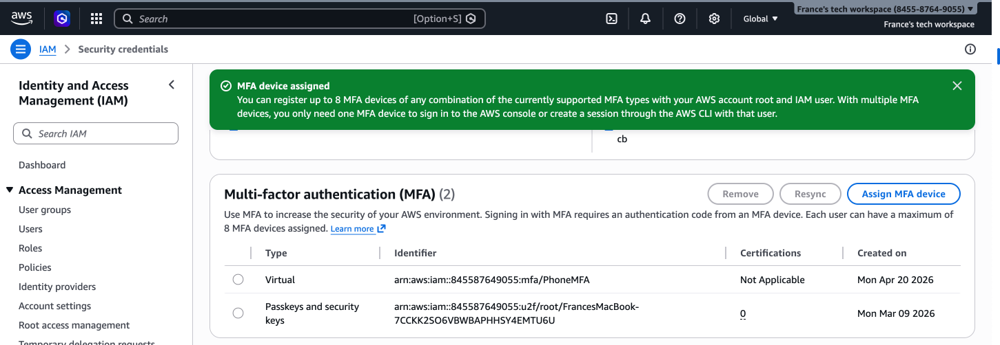
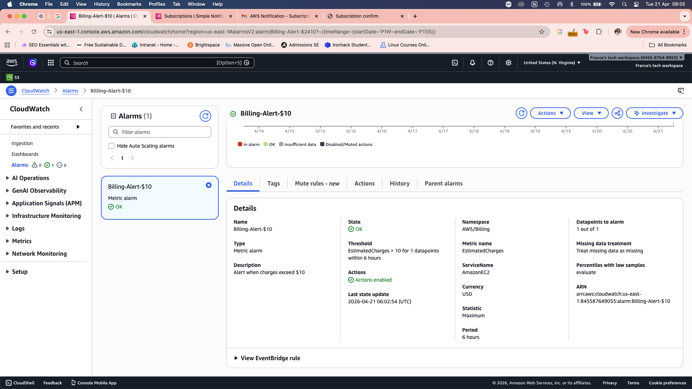
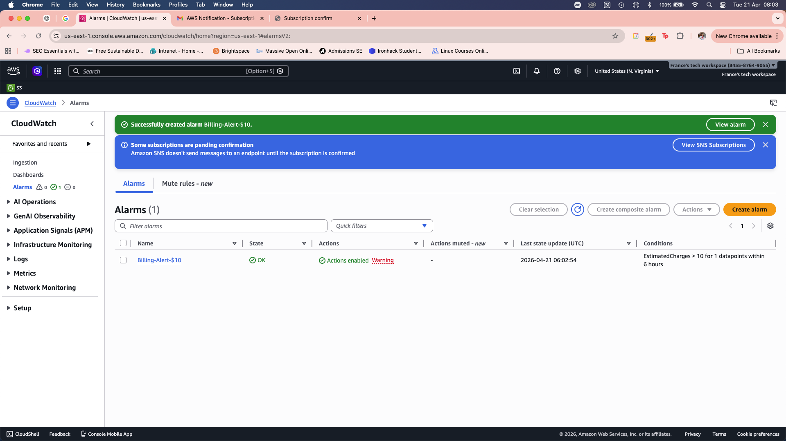
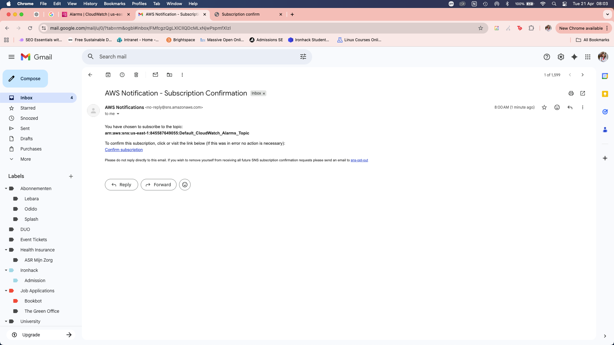
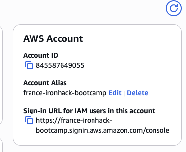
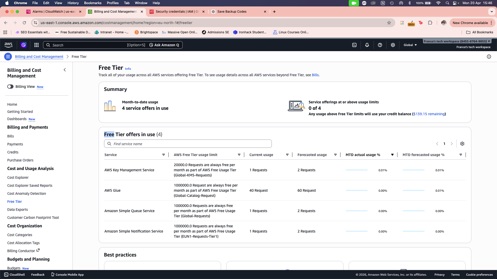

# AWS Account Setup Lab - Solution

**Student Name:** [France van Maanen]
**Date Completed:** [20 April]

---

## Exercise 1: MFA Configuration

### Screenshot:

### Notes:
- Authenticator app used: [Google Authenticator]
- MFA setup completed successfully: [Yes]
- Backup codes saved: [No]

---

## Exercise 2: Billing Alerts

### Screenshots:

**Billing Preferences:**

**Billing Alarm:**

**SNS Confirmation:**

### Configuration Details:
- Alert threshold: $[10]
- Email confirmed: [Yes]
- Additional thresholds created (bonus): [No]

---

## Exercise 3: Account Alias

### Screenshot:

### Account Details:
- **Account Alias:** [france-ironhack-bootcamp]
- **Sign-In URL:** `https://france-ironhack-bootcamp.signin.aws.amazon.com/console`
- **Tested successfully:** [Yes]

---

## Exercise 4: Free Tier Dashboard

### Screenshot:

### Current Free Tier Usage Summary:

| Service | Current Usage | Free Tier Limit | Status |
|---------|--------------|-----------------|--------|
| EC2 | [X hours / 750 hours] | 750 hours/month | [Green/Yellow/Red] |
| S3 | [X GB / 5 GB] | 5 GB | [Green/Yellow/Red] |
| [Other services...] | | | |

### Notes:
- Any services approaching limits? [No]
- Any unexpected usage? [Yes, current usage for AWS Glue is 40 requests]

---

## Exercise 5: Reflection Questions

### 1. Why is MFA important even for a personal learning account?

**Your Answer:**
[MFA is important because a credit card is connected to my AWS account. If the account gets hijacked it could incur unexpected costs in usage. Furthermore, MFA dramatically reduces the likeliness for an account to be compromised. ]

---

### 2. What would happen if you left your root user unprotected?

**Your Answer:**
[Besides financial risks, attackers could take sensitive data S3 buckets and RDS databases and lose control of the account. They could hold it for ransom or misuse it and increase risk to user fraud. To recover I would suggest to remove all access keys related to the root user and delete all to regain control. ]

---

### 3. How do billing alerts help prevent unexpected charges?

**Your Answer:**
[It gives you a heads up on how many credits are already used and forecasts how much more will be used. This helps optimize and manage finances over time. Alerts can be adjusted per preference and provide you an overview on what could be adjusted to allocate resources efficiently.]

---

### 4. What threshold did you set for your billing alert and why?

**Your Answer:**
[For the moment, I have set $10 as a threshold as it is a small project. But generally, setting a threshold depends on the fluctuations of costs therefore, the amount but set according to average usage to prevent spam mail every 6 hours for an amount that is below your budget.]

---

### 5. What is your account alias and why did you choose it?

**Your Answer:**
- **Alias:** [france-ironhack-bootcamp]
- **Reasoning:** [I didn't really give it much thought. I think I just used my name and the suggestion as it was appropriate for what it is for and where would it be used at the moment.]

---

### 6. What services are you currently using according to the Free Tier dashboard?

**Your Answer:**
[List the services you're using and their current usage levels. Are you surprised by any usage?]

---

## Bonus Challenges Completed (Optional)

### Challenge 1: Multiple Billing Alert Thresholds

- [ ] $5 threshold
- [ ] $25 threshold
- [ ] $50 threshold

**Screenshots (if completed):**
[Add screenshots here]

---

### Challenge 2: CloudTrail Enabled

- [ ] CloudTrail enabled
- [ ] Logging to S3 configured

**Notes:**
[Add any notes about CloudTrail setup]

---

### Challenge 3: AWS Trusted Advisor Reviewed

- [ ] Accessed Trusted Advisor
- [ ] Reviewed recommendations

**Key recommendations found:**
[List any recommendations you found]

---

## Lessons Learned

**What was the most challenging part of this lab?**

[Your answer]

---

**What would you do differently next time?**

[Your answer]

---

**What security practices will you implement going forward?**

[Your answer]

---

## Checklist Before Submission

- [ ] All required screenshots captured and saved
- [ ] Screenshots are clear and show relevant information
- [ ] All reflection questions answered thoroughly
- [ ] Account alias documented
- [ ] Free Tier usage documented
- [ ] Work committed to Git
- [ ] Pull request created
- [ ] PR URL submitted to Student Portal

---

**Lab Completed By:** [Your Name]  
**Date:** [Date]
